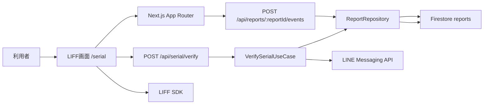
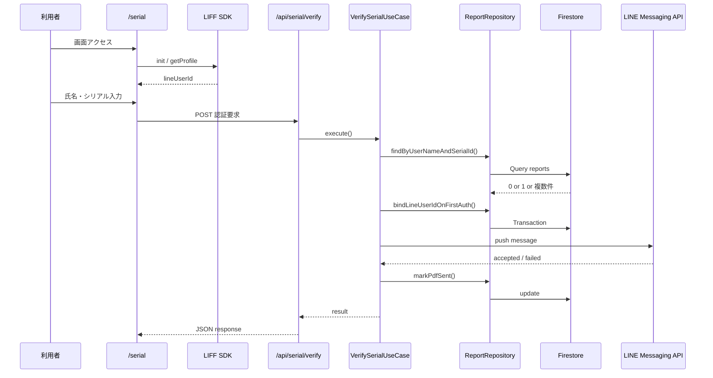

# システム設計書

## 1. 文書概要

### 1.1 目的

本書は、Nutrition LINE PoC の現行実装をベースに、システムの構成、責務分担、データ設計、処理フロー、外部連携、運用前提を整理することを目的とする。

### 1.2 対象システム

- システム名: Nutrition LINE PoC
- 目的: `氏名 + シリアルID` により利用者を認証し、LINE 経由で診断結果 PDF と商品導線を通知する
- 対象実装: Next.js App Router / Firebase Admin SDK / Firestore / LINE LIFF / LINE Messaging API

### 1.3 スコープ

本システムで扱う範囲は以下の通り。

- 認証画面表示
- LIFF による LINE ユーザー識別
- シリアル認証 API
- Firestore `reports` コレクションの参照・更新
- LINE Messaging API による通知送信
- 結果画面表示
- PDF / 商品リンク押下イベントの記録
- seed データ投入

本システムで扱わない範囲は以下の通り。

- 管理画面
- 決済
- PDF ファイル生成
- 購入 URL の動的生成
- 帳票運用の承認フロー

## 2. システム概要

利用者は LINE アプリ内の LIFF 画面から氏名とシリアル ID を入力する。サーバーは Firestore 上の `reports` を検索し、初回認証時のみ `lineUserId` を登録する。同一レコードが有効であれば LINE Messaging API で結果通知を送信し、必要に応じて結果画面で PDF および商品導線を表示する。

## 3. 全体構成



### 3.1 採用技術

- フロントエンド: Next.js 15, React 19, TypeScript
- バックエンド: Next.js Route Handler
- データストア: Firestore
- 外部認証連携: LIFF SDK
- 外部通知連携: LINE Messaging API
- バリデーション: Zod
- デプロイ想定: Firebase Hosting + frameworks backend (`asia-east1`)

### 3.2 論理構成

- `app/`
  - 画面、および Route Handler を配置
- `src/usecases/`
  - 認証ユースケースを配置
- `src/repositories/`
  - Firestore アクセスを集約
- `src/services/identity/`
  - クライアントサイドの LINE ユーザー識別を担当
- `src/services/line/`
  - サーバーサイドの LINE 通知送信を担当
- `src/lib/`
  - 環境変数、Firebase 初期化などの横断機能を配置
- `scripts/`
  - seed データ投入処理

## 4. 画面設計

### 4.1 画面一覧

| 画面 | パス | 役割 |
| --- | --- | --- |
| トップ | `/` | `/serial` へリダイレクト |
| シリアル認証画面 | `/serial` | LIFF で LINE ユーザー識別後、氏名とシリアル ID を入力して認証 |
| 結果画面 | `/result/[reportId]` | 診断結果 PDF と商品導線を表示 |
| Not Found | `/not-found` | レポート未存在時のフォールバック |

### 4.2 画面遷移

```text
/ -> /serial

/serial
  - LIFFログイン成功 + 認証成功 + LIFFクライアント内でclose可能
      -> 画面を閉じる
  - LIFFログイン成功 + 認証成功 + close不可
      -> /result/{reportId}
  - 認証失敗
      -> /serial に留まりエラー表示

/result/{reportId}
  - PDFリンク押下 -> 外部PDFを新規タブで表示
  - 商品リンク押下 -> 外部購入URLを新規タブで表示
```

### 4.3 UI 上の制御

- `serialId` は英数字 6 文字で入力チェックする
- `userName` は空文字不可
- `lineUserId` が取得できない場合は送信不可
- 結果画面では `resultPdfUrl` がない場合、PDF iframe は表示しない
- イベント記録失敗は利用者操作をブロックしない

## 5. 機能設計

### 5.1 LIFF による LINE ユーザー識別

クライアントは `NEXT_PUBLIC_LIFF_ID` を使用して LIFF SDK を初期化する。

1. LIFF SDK を動的ロードする
2. `liff.init()` を実行する
3. 未ログインなら `liff.login()` へ遷移する
4. ログイン済みなら `liff.getProfile()` で `userId` を取得する
5. 取得した `userId` を `lineUserId` として認証 API に送る

### 5.2 シリアル認証

`POST /api/serial/verify` が認証要求を受け付け、`VerifySerialUseCase` が主処理を実行する。

#### 認証条件

- `userName + serialId` で Firestore を検索する
- 0 件の場合は `invalid`
- 2 件以上の場合は `error`
- 1 件の場合は次を判定する
  - `lineUserId` 未登録: 現在の LINE ユーザー ID を登録する
  - 同一 `lineUserId` 登録済み: 認証可
  - 異なる `lineUserId` 登録済み: `invalid`

#### 認証成功時の後続処理

1. 購入 URL を `report.purchaseUrl` または `PURCHASE_LINK_DEFAULT` から決定する
2. `resultPdfUrl` と購入 URL の両方が存在することを確認する
3. LINE Messaging API へ push message を送信する
4. 成功時に `pdfSendFlag = true` を更新する
5. `reportId` を返却する

### 5.3 結果表示

結果画面では Firestore から `reportId` に対応するレポートを取得し、以下を表示する。

- 診断結果 PDF の iframe 埋め込み
- PDF を別タブで開くリンク
- 商品購入ページリンク

### 5.4 イベント記録

`POST /api/reports/{reportId}/events` は以下 2 種類のイベントを受け付ける。

- `pdf_clicked`
  - `pdfClickedFlag = true`
- `url_clicked`
  - `urlClickedFlag = true`

更新時は `updatedAt` も更新する。

## 6. データ設計

### 6.1 Firestore コレクション

- コレクション名: `reports`
- ドキュメント ID: Firestore 自動採番

### 6.2 ドキュメント定義

| 項目 | 型 | 必須 | 説明 |
| --- | --- | --- | --- |
| `createdAt` | `Timestamp` | Yes | 作成日時 |
| `birthday` | `string` | Yes | 生年月日 (`YYYY-MM-DD`) |
| `userName` | `string` | Yes | 認証に使う氏名 |
| `serialId` | `string` | Yes | 英数字 6 文字のシリアル ID |
| `purchaseUrl` | `string` | Yes | 商品導線 URL |
| `storagePath` | `string` | Yes | PDF 保管先パス。現行実装では参照しない |
| `resultPdfUrl` | `string` | Yes | 結果 PDF 表示 URL |
| `lineRegistrationFlag` | `boolean` | No | LINE ユーザー紐付け済みフラグ |
| `pdfSendFlag` | `boolean` | No | LINE 通知送信完了フラグ |
| `lineUserId` | `string \| null` | No | 紐付いた LINE ユーザー ID |
| `pdfClickedFlag` | `boolean` | No | PDF 押下済みフラグ |
| `urlClickedFlag` | `boolean` | No | 商品 URL 押下済みフラグ |
| `updatedAt` | `Timestamp` | Yes | 更新日時 |

### 6.3 フラグの意味

| 項目 | 更新契機 |
| --- | --- |
| `lineRegistrationFlag` | 初回認証時、または既存 `lineUserId` が同一でフラグ未設定時 |
| `pdfSendFlag` | LINE 通知送信成功時 |
| `pdfClickedFlag` | 利用者が PDF リンクを押下した時 |
| `urlClickedFlag` | 利用者が商品リンクを押下した時 |

### 6.4 データ整合性方針

- `userName + serialId` は業務上一意である前提
- ただし Firestore の一意制約は未実装のため、重複検知はアプリケーション側で行う
- seed 投入時も既存検索を行い、2 件以上の重複があればエラーとする

## 7. API 設計

### 7.1 `POST /api/serial/verify`

#### リクエスト

```json
{
  "serialId": "A1b2C3",
  "lineUserId": "Uxxxxxxxxxxxxxxxxxxxxxxxxxxxxxxxx",
  "userName": "佐藤太郎"
}
```

#### バリデーション

- `serialId`: `/^[A-Za-z0-9]{6}$/`
- `lineUserId`: 1 文字以上
- `userName`: trim 後 1 文字以上、80 文字以下

#### 正常レスポンス

```json
{
  "ok": true,
  "reportId": "xxxxxxxx",
  "result": "success",
  "message": "認証が完了しました。診断結果をご確認ください。"
}
```

#### 異常レスポンス

```json
{
  "ok": false,
  "result": "invalid",
  "message": "氏名またはシリアルIDが無効です。"
}
```

#### ステータスコード

- `200`: 認証成功
- `400`: 入力不正、または業務上の無効ケース
- `409`: 重複データなどの業務エラー
- `500`: 想定外エラー

### 7.2 `POST /api/reports/{reportId}/events`

#### リクエスト

```json
{
  "event": "pdf_clicked"
}
```

#### ステータスコード

- `200`: 更新成功
- `400`: 入力不正
- `404`: `reportId` 不存在
- `500`: 想定外エラー

## 8. 外部連携設計

### 8.1 LIFF SDK

- 利用目的: LINE ログイン済みユーザーの `userId` 取得
- 実行場所: ブラウザ
- 必須設定: `NEXT_PUBLIC_LIFF_ID`

### 8.2 LINE Messaging API

- 利用目的: 診断結果通知の push message 送信
- 実行場所: サーバー
- エンドポイント: `${LINE_API_BASE_URL}/v2/bot/message/push`
- 認証: `Authorization: Bearer {LINE_CHANNEL_ACCESS_TOKEN}`

#### 送信メッセージ内容

- 認証完了メッセージ
- シリアル ID
- 診断結果 PDF URL
- 商品購入 URL

### 8.3 Firestore

- 利用目的: レポート情報および利用状況フラグの保持
- 接続方式: Firebase Admin SDK
- 認証情報: サービスアカウント

## 9. 処理シーケンス

### 9.1 認証から通知まで



### 9.2 結果画面でのイベント記録

1. 利用者が PDF または商品リンクを押下する
2. クライアントが `keepalive: true` でイベント API を呼ぶ
3. サーバーが対応するフラグを `true` に更新する
4. 外部リンク遷移はイベント記録失敗に影響されない

## 10. 環境変数設計

### 10.1 サーバーサイド必須

| 変数名 | 用途 |
| --- | --- |
| `FIREBASE_PROJECT_ID` | Firebase プロジェクト ID |
| `FIREBASE_CLIENT_EMAIL` | サービスアカウントのメールアドレス |
| `FIREBASE_PRIVATE_KEY` | サービスアカウント秘密鍵 |
| `LINE_CHANNEL_ACCESS_TOKEN` | Messaging API 呼び出しトークン |

### 10.2 サーバーサイド任意

| 変数名 | 用途 | 既定値 |
| --- | --- | --- |
| `APP_BASE_URL` | アプリベース URL | `http://localhost:3000` |
| `LINE_API_BASE_URL` | LINE API ベース URL | `https://api.line.me` |
| `PURCHASE_LINK_DEFAULT` | `purchaseUrl` 未設定時の代替 URL | なし |
| `IMAGE_PLACEHOLDER_URL` | 将来用の画像 URL | なし |

### 10.3 クライアントサイド

| 変数名 | 用途 |
| --- | --- |
| `NEXT_PUBLIC_LIFF_ID` | LIFF アプリ ID |

## 11. 非機能設計

### 11.1 性能

- 認証時の主要 I/O は Firestore クエリ、Firestore Transaction、LINE API 呼び出し
- 同時アクセスは PoC 規模を想定
- レポート検索は `userName + serialId` 条件で行うため、将来的には複合インデックスと検索キー正規化の検討余地がある

### 11.2 可用性

- 外部依存先は Firestore、LIFF SDK、LINE Messaging API
- LINE 通知失敗時は認証済みでも `error` 応答となる
- イベント記録失敗は UX 優先で黙殺する

### 11.3 セキュリティ

- サーバー秘密情報は環境変数で管理する
- Firestore アクセスは Admin SDK のみを想定する
- `lineUserId` は初回認証時のみ登録し、別 LINE アカウントへの横取りを防ぐ

### 11.4 ログ/監視

現行実装では業務ログ、監査ログ、APM、アラートは未実装。PoC から本番へ拡張する場合、以下の追加が必要である。

- 認証結果ログ
- LINE API 失敗ログ
- Firestore 更新失敗ログ
- 運用向けメトリクスと通知

## 12. デプロイ・運用設計

### 12.1 ローカル起動

```bash
npm install
npm run seed
npm run dev
```

### 12.2 seed 投入

`data/seedReports.json` を入力として `reports` コレクションへ upsert する。

```bash
npm run seed:reports
```

### 12.3 デプロイ前提

- Firebase Hosting の frameworks backend を使用する
- バックエンドリージョンは `asia-east1`
- Next.js の `outputFileTracingRoot` を有効化している

## 13. 既知制約と今後の検討事項

現行実装に基づく制約は以下の通り。

- `userName` は完全一致比較であり、表記ゆれ吸収は未適用
- `src/lib/nameNormalizer.ts` は存在するが認証処理では未使用
- `storagePath` は保持しているが、実行時に参照していない
- 結果画面は `reportId` をキーに表示するのみで、画面表示時の再認可は行っていない
- イベント API に認可制御はなく、`reportId` を知っていれば更新できる
- LINE 通知はテキストメッセージ 1 通であり、Flex Message やテンプレートメッセージは未採用
- LINE 通知送信成功後に結果画面へ遷移する設計だが、LIFF クライアント内で `closeWindow()` 成功時は画面遷移しない

## 14. 関連ファイル

- `app/serial/page.tsx`
- `app/result/[reportId]/page.tsx`
- `app/api/serial/verify/route.ts`
- `app/api/reports/[reportId]/events/route.ts`
- `src/usecases/verifySerialUseCase.ts`
- `src/repositories/reportRepository.ts`
- `src/services/identity/lineIdentityService.ts`
- `src/services/line/lineMessagingApiService.ts`
- `src/lib/firebaseAdmin.ts`
